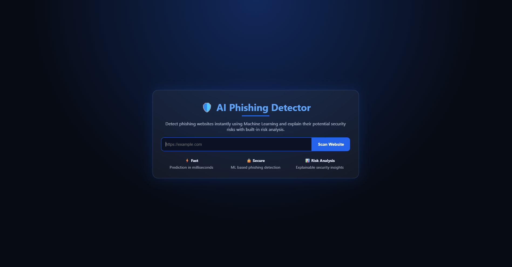
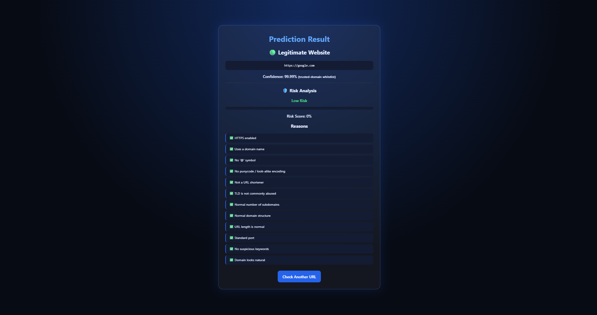
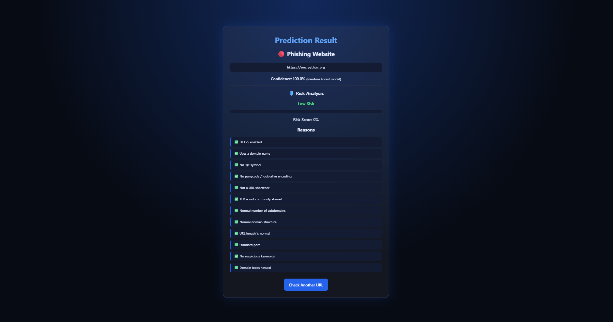
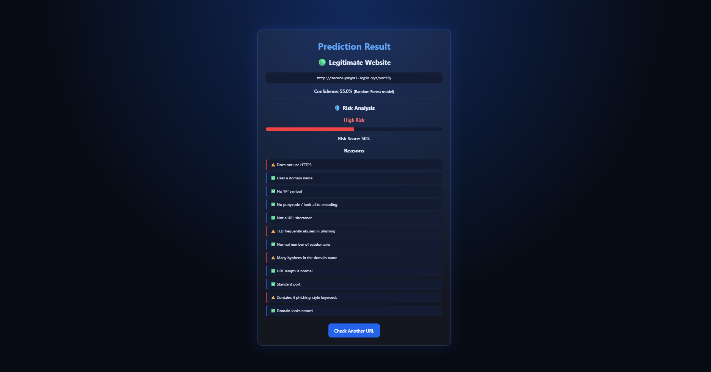
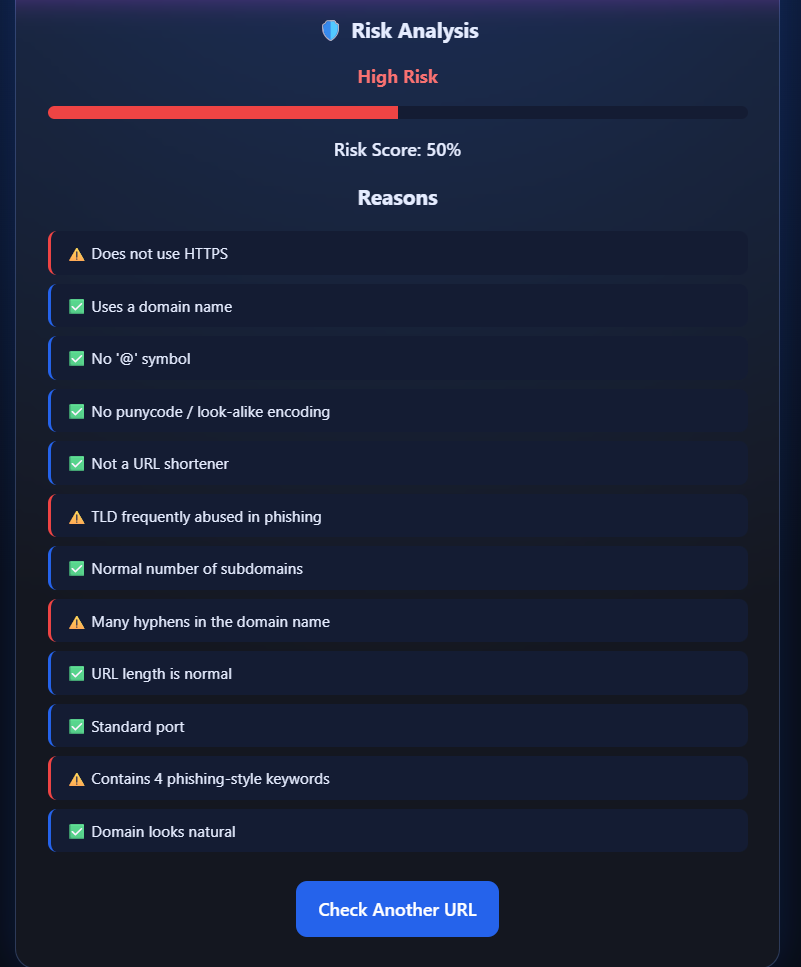

# Phishing Website Detection using URL-Based Feature Analysis

[](https://github.com/Aaditya-34/phishing-url-detector/actions/workflows/ci.yml)
[](https://www.python.org/downloads/)
[](LICENSE)

**IEEE CS Bangalore Chapter Internship & Mentorship Program 2026 — Project P98**  
A machine learning web application that classifies URLs as phishing, suspicious, or legitimate in real time using lexical and structural URL features alone, paired with a transparent rule-based risk heuristic engine.

---

## Team & Mentorship

- **Team Members:** Naina Ramesh, Ritesh Choudhary, Deepak Vaishnav, Aaditya Raaj Pandit
- **Project Mentor:** Dr. V. Muthu Ganesh, Presidency University

---

## Overview & Architecture

Phishing remains one of the most prominent attack vectors in cybercrime. While dynamic page-content and visual analysis require crawling remote servers (introducing significant latency and exposing crawlers to malicious payloads), **URL-only analysis** enables sub-millisecond screening directly on client devices, proxies, or security gateways.

### Detection Pipeline
```
[ Input URL ]
      │
      ▼
[ Step 1: Whitelist Verification ] ──(exact registered domain)──► [ Legitimate Website (99.99%) ]
      │ (not whitelisted)
      ▼
[ Step 2: Lexical Feature Extraction ] (27 structural & statistical features)
      │
      ├──► [ Step 3: Random Forest Classifier ] ──► Probability & ML Classification
      │
      └──► [ Step 4: Rule-Based Risk Audit Engine ] ──► Heuristic Risk Score (0-100) & Explanations
      │
      ▼
[ Step 5: Three-State Overall Verdict & Unified Reporting ]
   ├── ML says phishing (p >= 0.5) ─────────────► "Phishing Website" 🔴
   ├── Else if rule-based score >= 50 ──────────► "Suspicious Website" 🟡
   └── Else ────────────────────────────────────► "Legitimate Website" 🟢
```

1. **Trusted-Domain Whitelist Filter:** Matches the *exact registered domain* against `data/trusted_domains.txt` (e.g., `google.com` passes, but subdomain lookalikes such as `google.com.evil.tk` are strictly rejected). Executes in **0.03 ms**.
2. **Feature Extraction:** Extracts 27 lexical and statistical properties without network requests (length, dots, hyphens, subdomains, entropy, IP presence, sensitive keywords, punycode, TLD reputation).
3. **Machine Learning Classifier:** Evaluates the URL using a domain-grouped, host-only trained Random Forest (`models/model.pkl`, threshold 0.5).
4. **Heuristic Risk Audit:** Computes an interpretable 0–100 risk score with human-readable security indicators (e.g., absence of HTTPS, suspicious TLD, excessive subdomains, keywords).
5. **Three-State Overall Verdict:** Produces an overall verdict of `"Phishing Website"`, `"Suspicious Website"`, or `"Legitimate Website"`, while displaying the ML verdict and rule-based risk metrics separately underneath.

---

## UI Screenshots

The web interface uses a glassmorphism theme designed with vanilla CSS:

| Home Interface | Legitimate Whitelist Result |
| :---: | :---: |
|  |  |
| *Landing page with instant URL scanner* | *Whitelisted destination (e.g. google.com)* |

| Legitimate ML Prediction | Phishing Detection Result | Rule-Based Explanations |
| :---: | :---: | :---: |
|  |  |  |
| *ML classification for non-whitelisted domain* | *High-risk phishing alert* | *Transparent breakdown of risk reasons* |

---

## Experimental Results & Evaluation

All experimental figures are generated from the standardized evaluation pipeline and documented in `reports/RESULTS_SUMMARY.md`.

### Evaluation Protocol: Leakage Discovery & Host-Only Baseline
Standard public URL benchmarks often suffer from **collection methodology artifacts**. In our source dataset (`data/dataset.csv`: 20,000 PhishTank phishing URLs and 20,000 Tranco benign domains):
- 100.0% of Tranco benign URLs are root hostnames without paths (`/`).
- 64.9% of PhishTank phishing URLs contain directory paths or URL parameters.

A classifier trained on raw full URLs trivially exploits path presence, reaching **99.75% accuracy** simply by checking `num_slashes` and `path_length` (`reports/leakage_diagnostic.txt`):
- Accuracy using *only* path and scheme features: **0.9901**
- Accuracy using *all* features on full URLs: **0.9975** (inflated)
- Accuracy on **host-only URLs**: **0.9348** (**honest baseline**)

To prevent optimistic bias, all production models are trained and evaluated in **Host-Only mode** on **31,717 unique hostnames** with domain-grouped splits (80/20 train/test, seed 42) ensuring no domain overlaps between train and test sets.

### Model Performance Comparison

#### Realistic Host-Only Baseline & Hybrid Evaluation (Deployed `models/model.pkl` — Test N = 5,908)
*Cross-validation F1 (Random Forest): 0.9098 ± 0.0068*

| Classifier / Strategy | Accuracy | Precision | Recall | F1-Score | ROC-AUC | FPR | Train Time |
| :--- | :--- | :--- | :--- | :--- | :--- | :--- | :--- |
| **Random Forest (Deployed)** | **0.9348** | **0.9470** | **0.8450** | **0.8931** | **0.9448** | **0.0225** | **0.70s** |
| **Hybrid (RF OR Rule >= 50)** | **0.9348** | **0.9470** | **0.8450** | **0.8931** | **N/A** | **0.0225** | **—** |
| **SVM (RBF Kernel)** | 0.9369 | 0.9799 | 0.8208 | 0.8933 | 0.9329 | 0.0080 | 13.88s |
| **Logistic Regression** | 0.9328 | 0.9754 | 0.8119 | 0.8861 | 0.9480 | 0.0097 | 0.06s |

*Hybrid Evaluation (`reports/hybrid.json`): Flags a URL if ML predicts phishing (threshold 0.5) OR rule-based score $\ge 50$. On the held-out test split, ML phishing recall alone is **0.8450** (84.50%).*

#### Full-URL Laboratory Benchmark (Test N = 11,046 — Inflated by Path Leakage)
*Cross-validation F1 (Random Forest): 0.9965 ± 0.0007*

| Classifier | Accuracy | Precision | Recall | F1-Score | ROC-AUC | FPR | Train Time |
| :--- | :--- | :--- | :--- | :--- | :--- | :--- | :--- |
| **Random Forest** | 0.9975 | 0.9993 | 0.9967 | 0.9980 | 0.9988 | 0.0013 | 0.71s |
| **SVM (RBF Kernel)** | 0.9968 | 0.9984 | 0.9966 | 0.9975 | 0.9988 | 0.0028 | 4.28s |
| **Logistic Regression** | 0.9974 | 0.9999 | 0.9960 | 0.9979 | 0.9990 | 0.0003 | 0.04s |

---

### Top Feature Importances (Gini Impurity Reduction)

- **Host-Only Random Forest (`metrics_host_only.json`):**
  1. `num_subdomains` (30.42%)
  2. `hostname_length` (16.57%)
  3. `url_length` (14.51%)
  4. `num_dots` (14.25%)
  5. `domain_entropy` (5.01%)
  6. `tld_length` (3.62%)
  7. `num_digits` (2.89%)
  8. `digit_ratio` (2.53%)
  9. `num_hyphens` (2.50%)
  10. `letter_ratio` (2.35%)

- **Full-URL Random Forest (`metrics_full_url.json` — Leakage Demonstration):**
  1. `num_slashes` (27.05%)
  2. `path_length` (23.45%)
  3. `url_length` (14.53%)
  4. `num_subdomains` (11.50%)
  5. `num_dots` (4.78%)

---

### Latency Benchmark

Measured across 1,000 held-out URLs (`reports/latency.json`):

| Pipeline Stage | Mean | p50 Median | p95 | p99 |
| :--- | :--- | :--- | :--- | :--- |
| **Feature Extraction** | 0.024 ms | 0.022 ms | 0.028 ms | 0.039 ms |
| **Model Inference (`predict_proba`)** | 26.67 ms | 25.20 ms | 35.95 ms | 37.89 ms |
| **Full Detector (ML Path)** | 26.99 ms | 25.47 ms | 36.25 ms | 40.66 ms |
| **Whitelist Fast Path** | **0.031 ms** | **0.029 ms** | **0.034 ms** | **0.043 ms** |

---

### Adversarial Robustness Assessment

Evaluated on 1,609 correctly classified phishing hostnames under simple lexical transforms (`reports/robustness.json`).  
*(Note: Evaluates robustness to simple lexical evasion only, not an adaptive adversary.)*

| Perturbation Transform | Detection Rate | Evasion Rate |
| :--- | :--- | :--- |
| **Baseline (Unperturbed)** | 100.00% (1,609/1,609) | 0.00% |
| **Add `www` Subdomain** | 100.00% (1,609/1,609) | 0.00% |
| **Lengthen Subdomain** (`portal.`) | 100.00% (1,609/1,609) | 0.00% |
| **Insert One Hyphen** | 96.64% (1,555/1,609) | 3.36% |
| **Swap TLD to `.com`** | 96.64% (1,555/1,609) | 3.36% |
| **Append Numeric Label** (`-01`) | 95.77% (1,541/1,609) | 4.23% |

---

### Independent Cross-Dataset Evaluation

Evaluated against the independent benchmark `ISCX-URL2016 / Kaggle Malicious URLs Dataset` (Manu Siddhartha / sid321axn; 87.94% legitimate URLs have real paths; CC0 Public Domain; `reports/cross_dataset.json`):

- **Cross-Dataset Generalization:** Model trained on primary host-only dataset and tested on 7,517 unseen ISCX hostnames achieves **59.01% accuracy** (Precision: 73.86%, Recall: 48.97%, F1: 58.89%, ROC-AUC: 61.64%), reflecting significant domain distribution shift across threat feeds.
- **Within-Dataset Full-URL Benchmark:** Training and evaluating on the second dataset directly (where legitimate URLs have authentic paths) achieves **88.65% accuracy** (Precision: 96.36%, Recall: 82.55%, F1: 88.92%, ROC-AUC: 91.47%), confirming that lexical models remain effective without path artifacts.

---

## Limitations

1. **Host-Only Limitation:** The host-only model deliberately strips paths to prevent training artifacts, which prevents detecting malicious deep paths hosted on legitimate shared platforms.
2. **Shared-Hosting Blind Spot:** Phishing pages hosted on compromised subpaths of legitimate providers (e.g., `sites.google.com/view/phish`, `github.io`, `firebaseapp.com`) cannot be distinguished from benign sites using hostnames alone.
3. **Dataset Feed Bias:** PhishTank represents active user-reported phishing campaigns, whereas Tranco captures high-traffic global domains; neither captures long-tail benign personal sites or enterprise intranets.
4. **Lack of Dynamic Context:** The system evaluates lexical URL structure only, omitting live WHOIS domain age, DNS resolution records, SSL/TLS certificate validity, and rendered DOM content.
5. **Adversarial Scope:** Lexical perturbation tests evaluate simple automated transforms, not adaptive human adversaries using homograph IDN attacks or domain fronting.

---

## Setup & Execution

### 1. Installation
```bash
git clone https://github.com/Aaditya-34/phishing-url-detector.git
cd phishing-url-detector

python -m venv venv
# Windows:
.\venv\Scripts\activate
# Linux/macOS:
source venv/bin/activate

pip install -r requirements.txt
```

### 2. Dataset Reconstruction & Training
```bash
# Prepare dataset from raw feeds (PhishTank + Tranco)
python scripts/prepare_dataset.py --phishtank data/online-valid.csv --tranco data/top-1m.csv --n 20000 --out data/dataset.csv

# Train deployed Host-Only Random Forest model (writes models/model.pkl and reports/metrics_host_only.json)
python -m src.train --data data/dataset.csv --host-only --deploy

# Optionally train full-URL model for leakage comparison
python -m src.train --data data/dataset.csv
```

### 3. Run Tests
```bash
python -m pytest -q tests
```

### 4. Start Web Application
```bash
python app.py
# Open http://127.0.0.1:5000 in your browser
```

---

## API Usage

The application provides a REST endpoint for automated URL evaluation:

### Request
```bash
curl -X POST http://127.0.0.1:5000/api/predict \
     -H "Content-Type: application/json" \
     -d '{"url": "http://secure-paypal-login.xyz/verify"}'
```

### Response
```json
{
  "confidence": 55.0,
  "label": "Legitimate Website",
  "level": "High Risk",
  "phishing": false,
  "reasons": [
    {
      "ok": false,
      "text": "Does not use HTTPS"
    },
    {
      "ok": true,
      "text": "Uses a domain name"
    },
    {
      "ok": false,
      "text": "TLD frequently abused in phishing"
    },
    {
      "ok": false,
      "text": "Many hyphens in the domain name"
    },
    {
      "ok": false,
      "text": "Contains 4 phishing-style keywords"
    }
  ],
  "score": 50,
  "source": "Random Forest model",
  "url": "http://secure-paypal-login.xyz/verify",
  "verdict": "Suspicious Website"
}
```

---

## Repository Structure

```
phishing-url-detector/
├── app.py                      Flask backend (routes: /, /predict, /api/predict)
├── src/
│   ├── ftr_ext.py              27-dimension URL feature extraction
│   ├── risk_analysis.py        0-100 heuristic risk scoring and reason generator
│   ├── predictor.py            Detection orchestration (whitelist -> ML -> heuristics -> 3-state verdict)
│   └── train.py                Model training, evaluation, CV, and plot generation
├── scripts/
│   ├── prepare_dataset.py      Constructs balanced dataset from raw sources
│   ├── diagnose_leakage.py     Quantifies path-leakage artifact
│   ├── benchmark_latency.py    Measures per-stage latency percentiles
│   ├── robustness_test.py      Tests lexical perturbation evasion rates
│   └── cross_dataset_eval.py   Evaluates cross-dataset out-of-distribution performance
├── data/
│   ├── README.md               Data provenance, download dates, sha256 checksums
│   ├── trusted_domains.txt     Registered-domain whitelist
│   └── dataset.csv             Balanced dataset (20k phishing, 20k benign)
├── models/
│   └── model.pkl               Deployed host-only Random Forest bundle (~10.8 MB)
├── reports/
│   ├── RESULTS_SUMMARY.md      Complete benchmark numbers and audit log
│   ├── metrics_host_only.json  Detailed host-only model evaluation metrics
│   ├── metrics_full_url.json   Detailed full-URL evaluation metrics
│   ├── hybrid.json             Hybrid (ML OR rule score >= 50) evaluation
│   ├── latency.json            Latency benchmarks (p50, p95, p99)
│   ├── robustness.json         Lexical perturbation evasion statistics
│   ├── cross_dataset.json      Independent benchmark evaluation
│   └── *.png                   Confusion matrices, ROC curves, and feature importances
├── docs/
│   └── screenshots/            Application UI screenshots (01_home.png - 05_reasons.png)
├── templates/ & static/        Responsive web interface (glassmorphism UI)
├── tests/                      Pytest unit and endpoint integration test suite
└── requirements.txt            Application dependencies
```

---

## References

1. **Safi, A., & Singh, S. (2023).** A systematic literature review on phishing website detection techniques. *Journal of King Saud University - Computer and Information Sciences*, 35(2), 590-611. *(Analyzed 80 papers: PhishTank used in 53 studies, Alexa/Tranco in 29 studies, Random Forest in 31 studies).*
2. **Tian, Z., et al. (2025).** From Past to Present: A Survey of Malicious URL Detection Techniques, Datasets and Code Repositories. *arXiv preprint arXiv:2504.16449*.
3. **Sahoo, D., Liu, C., & Hoi, S. C. (2017).** Malicious URL Detection using Machine Learning: A Survey. *arXiv preprint arXiv:1701.07179*.
